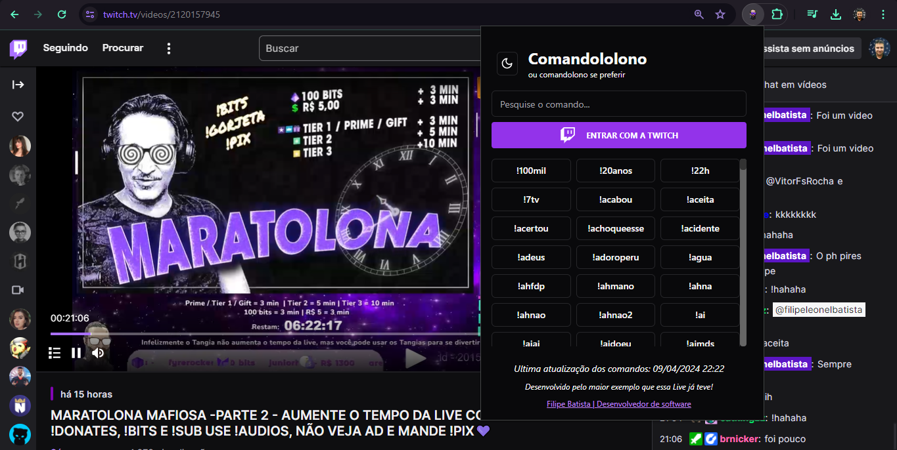

# Comandololono - Extensão de comandos da live

# Indice

- [Sobre](#-sobre)
- [Tecnologias](#Tecnologias)
- [Instalação](#Instalação)

## 🔖&nbsp; Sobre

Aplicativo com a lista de comandos da live para ficar facil o envio nas lives.

[Download](.github/extension.crx)

## Objetivo

Criei este app para a comunidade de um streamer que eu curto muito e ofereci isso para melhorar a interação nas lives para quem usa o PC.
 
---
## Tecnologias

Esse projeto foi desenvolvido com as seguintes principais tecnologias:

- [React JS](https://legacy.reactjs.org/docs/getting-started.html)
- [TailwindCSS](https://tailwindcss.com/)
- [Typescript](https://www.typescriptlang.org/)
- [Vite](https://vitejs.dev/)
- [Chrome extensions manifest](https://developer.chrome.com/docs/extensions/develop/migrate?hl=pt-br)

e mais...

---
## Instalação

O projeto roda com [Node.js](https://nodejs.org/) v20+.

Instruções para instalar as dependencias e inicie o projeto.

Necessário adicionar as variaveis de ambiente para seguir o desenvolvimento conforme o arquivo `.env.example`

### Web

Para desenvolver usando web.

```sh
cd comandololono-chrome-extension
npm i
npx run dev
```

### Caso queira ver no navegador Chrome

Precisa fazer o build 

```sh
npx run build
```

Então isso gerará a pasta `dist` que será usada para a extensão.

Vai no navegador Google Chrome `Extensões > Gerenciar extensões` e  habilite o `Modo desenvolvedor` em seguida clique em `Carregar extensão` e selecione a pasta `dist`.

O único porém é que em cada alteração que você quiser ver será necessário fazer o build da aplicação.


### Passos

- [x] Criar projeto
- [x] Contexto de autenticação da twitch
- [x] Criação da tela e componentes
- [x] Copiar para a area de transferência o comando
- [x] Filtrar o comando na pesquisa
- [x] Lista vazia
- [ ] Enviar o comando direto para a twitch ao clicar
- [ ] Login na twitch com a extensão

---

<h3 align="center" >Vamos nos conectar 😉</h3>
<p align="center">
  <a href="https://www.linkedin.com/in/filipeleonelbatista/">
    
  </a>&ensp;
  <a href="mailto:filipe.x2016@gmail.com">
    
  </a>&ensp;
  <a href="https://instagram.com/filipeleonelbatista">
    
  </a>
</p>
<br />
<p align="center">
    Desenvolvido 💜 por Filipe Batista 
</p>
